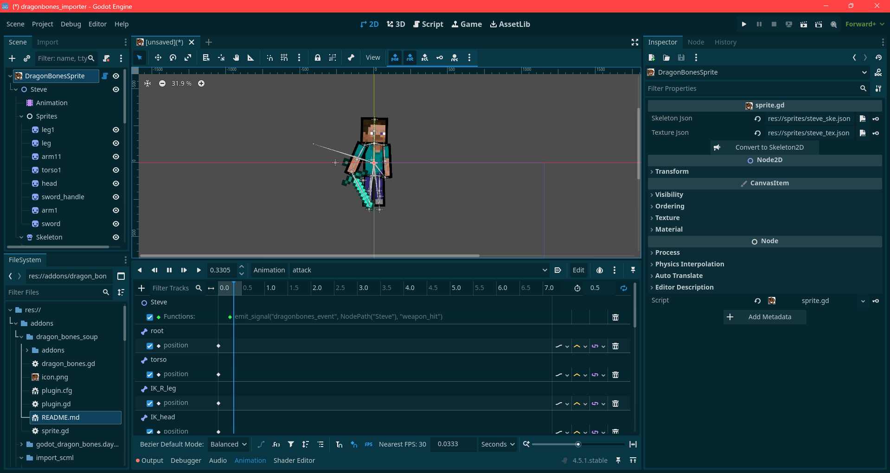

# Dragon Bone Soup

Yeah, I know about "Godot-DragonBones" but I reinvented the wheel anyway.

## What is this?

A Godot tool that converts DragonBones animations into native Godot skeletons. Specifically, I built this because I needed proper animation blending, and here we are.

Basically, you feed it your DragonBones JSON files and it spits out a Skeleton2D setup with all the bones, sprites, and animations ready to go.

## How to use it

1. Add "DragonBonesSprite" node to the scene
2. In the inspector, set your skeleton JSON path and texture atlas JSON path
3. Hit the "Convert to Skeleton2D" button
4. Done




## What gets converted

- Bone hierarchy and transforms
- Sprite attachments from your skin
- All animations with proper timing
- Animation events (fires a signal you can listen to)
- IK constraints (look-at and two-bone IK)
- Animation looping settings

## Dependencies

**Required:**
- Godot 4.4 or later. It hasn’t been tested on earlier versions, though it might still work.
- The [Skeleton2D IK addon](https://godotengine.org/asset-library/asset/2472) - for the IK constraints (SoupGroup, SoupLookAt, SoupTwoBoneIK).

You could theoretically ditch the IK addon and rewrite the IK setup to use Godot's built-in `SkeletonModificationStack2D` instead. Good luck with that though.


## Events

The script emits a `dragonbones_event` signal when animation events fire. Connect to it via editor or code like:

```gdscript
some_node.dragonbones_event.connect(_on_animation_event)

func _on_animation_event(node_path, event_name):
    print("Event fired: ", event_name)
```

## TODO (maybe)

Stuff I might add eventually:

- Support for multiple skins and slot displays
- Mesh deformation (if I ever actually need it)
- Better error messages when things go wrong
- Batch conversion for multiple files at once

No promises though.

---

That's about it. It works for my needs, maybe it'll work for yours.